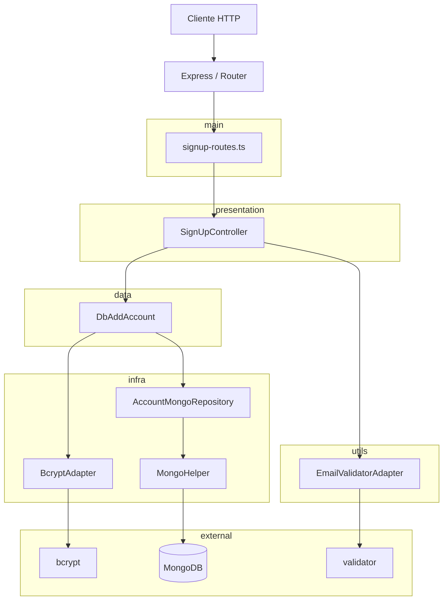

# Arquitetura — clean-node-api

> **Estilo arquitetural:** Clean Architecture (Robert C. Martin)

> **Stack:** Node.js · TypeScript · Express · MongoDB

> **Gerado em:** 2026-03-17

---

## Sumário

- [Arquitetura — clean-node-api](#arquitetura--clean-node-api)
  - [Sumário](#sumário)
  - [Visão Geral](#visão-geral)
  - [Camadas da Arquitetura](#camadas-da-arquitetura)
    - [1. `domain/` — Núcleo de Negócio](#1-domain--núcleo-de-negócio)
    - [2. `data/` — Casos de Uso (Application Layer)](#2-data--casos-de-uso-application-layer)
    - [3. `infra/` — Infraestrutura](#3-infra--infraestrutura)
    - [4. `presentation/` — Camada de Apresentação HTTP](#4-presentation--camada-de-apresentação-http)
    - [5. `utils/` — Adaptadores de Utilitários](#5-utils--adaptadores-de-utilitários)
    - [6. `main/` — Composição e Bootstrap](#6-main--composição-e-bootstrap)
  - [Fluxo de uma Requisição](#fluxo-de-uma-requisição)
  - [Diagrama de Componentes](#diagrama-de-componentes)
  - [Módulos e Responsabilidades](#módulos-e-responsabilidades)
    - [Factory: `makeSignUpController()`](#factory-makesignupcontroller)
    - [Carregamento de Rotas](#carregamento-de-rotas)
  - [Protocolos e Abstrações](#protocolos-e-abstrações)
  - [Padrões Adotados](#padrões-adotados)
  - [Dependências](#dependências)
    - [Produção](#produção)
    - [Desenvolvimento / Tooling](#desenvolvimento--tooling)
  - [Configuração e Ambiente](#configuração-e-ambiente)
  - [Scripts e Automações](#scripts-e-automações)
    - [Git Hooks (Husky)](#git-hooks-husky)
  - [Testes](#testes)
    - [Unitários (`*.spec.ts`)](#unitários-spects)
    - [Integração (`*.test.ts`)](#integração-testts)
  - [Rotas da API](#rotas-da-api)
    - [`POST /api/signup`](#post-apisignup)

---

## Visão Geral

O **clean-node-api** é uma API RESTful construída como estudo aplicado de **Clean Architecture**, onde cada decisão arquitetural prioriza separação de responsabilidades, testabilidade e independência de frameworks ou infraestrutura.

A arquitetura impõe que nenhuma camada interna dependa de camadas externas. O fluxo de dependências é sempre **de fora para dentro** — a infraestrutura depende do domínio, nunca o contrário.

```
┌─────────────────────────────────────────────────┐
│  main (Factories, Routes, Config, Server)        │ ← Composição
├─────────────────────────────────────────────────┤
│  presentation (Controllers, Helpers, Errors)     │ ← HTTP
├─────────────────────────────────────────────────┤
│  data (Use Cases, Protocols de dados)            │ ← Regras de aplicação
├─────────────────────────────────────────────────┤
│  domain (Models, Interfaces de Use Cases)        │ ← Regras de negócio puras
├─────────────────────────────────────────────────┤
│  infra (MongoDB, Bcrypt, Adapters)               │ ← Implementações externas
│  utils (Adapters de libs externas)               │
└─────────────────────────────────────────────────┘
```

---

## Camadas da Arquitetura

### 1. `domain/` — Núcleo de Negócio

Camada mais interna. Não importa nenhuma lib externa nem outra camada do projeto. Define contratos puros.

| Artefato | Tipo | Responsabilidade |
|---|---|---|
| `models/account.ts` | Interface | Modelo de domínio da Conta (`id`, `name`, `email`, `password`) |
| `useCases/add-account.ts` | Interface | Contrato `AddAccount` — entrada `AddAccountModel`, saída `AccountModel` |

### 2. `data/` — Casos de Uso (Application Layer)

Implementa a lógica de aplicação usando apenas os contratos do `domain` e seus próprios protocolos. Nunca depende de frameworks ou infraestrutura diretamente.

| Artefato | Tipo | Responsabilidade |
|---|---|---|
| `useCases/add-account/db-add-account.ts` | Classe | Implementa `AddAccount`: criptografa senha via `Encrypter` e persiste via `AddAccountRepository` |
| `protocols/encrypter.ts` | Interface | Contrato para criptografia de valores |
| `protocols/add-account-repository.ts` | Interface | Contrato para persistência de conta |

### 3. `infra/` — Infraestrutura

Implementações concretas dos protocolos definidos pelas camadas internas. Aqui vivem os adaptadores de banco de dados e bibliotecas externas.

| Artefato | Tipo | Responsabilidade |
|---|---|---|
| `criptography/bcrypt-adapter.ts` | Classe | Implementa `Encrypter` usando `bcrypt` (salt: 12) |
| `db/mongodb/account-repository/account.ts` | Classe | Implementa `AddAccountRepository` usando MongoDB |
| `db/mongodb/helpers/mongo-helper.ts` | Objeto | Gerencia conexão com o MongoDB (`connect`, `disconnect`, `getCollection`, `map`) |

### 4. `presentation/` — Camada de Apresentação HTTP

Responsável por adaptar o protocolo HTTP para as interfaces da camada de domínio/aplicação. Trata erros e formata respostas.

| Artefato | Tipo | Responsabilidade |
|---|---|---|
| `controllers/signup/signup.ts` | Classe | Valida campos obrigatórios, valida e-mail, confirma senha e chama `AddAccount` |
| `helpers/http-helper.ts` | Funções | `badRequest` (400), `ok` (200), `serverError` (500) |
| `errors/missing-param-error.ts` | Classe | Erro: campo obrigatório ausente |
| `errors/invalid-param-error.ts` | Classe | Erro: campo com valor inválido |
| `errors/server-error.ts` | Classe | Erro: falha interna do servidor |
| `protocols/controller.ts` | Interface | Contrato `Controller` com método `handle(req): Promise<HttpResponse>` |
| `protocols/email-validator.ts` | Interface | Contrato `EmailValidator` com método `isValid(email): boolean` |
| `protocols/http.ts` | Interfaces | `HttpRequest { body? }` e `HttpResponse { statusCode, body }` |

### 5. `utils/` — Adaptadores de Utilitários

Adapters de bibliotecas externas que implementam interfaces da camada `presentation`.

| Artefato | Tipo | Responsabilidade |
|---|---|---|
| `email-validator.ts` (adapter) | Classe | Implementa `EmailValidator` usando a lib `validator` |
| `email-validator.ts` (interface) | Interface | Contrato local para o adapter |

### 6. `main/` — Composição e Bootstrap

Ponto de entrada da aplicação. Reúne todas as camadas via **factories** e configura o servidor Express.

| Artefato | Responsabilidade |
|---|---|
| `server.ts` | Conecta ao MongoDB e sobe o servidor Express |
| `config/app.ts` | Cria instância Express, registra middlewares e rotas |
| `config/env.ts` | Centraliza variáveis de ambiente (`MONGO_URL`, `PORT`) |
| `config/middlewares.ts` | Registra `cors`, `bodyParser`, `contentType` globalmente |
| `config/routes.ts` | Carrega automaticamente arquivos `*routes.ts` via `fast-glob` |
| `factories/signup.ts` | Factory `makeSignUpController()` — monta o grafo de dependências completo |
| `middlewares/` | Implementações dos middlewares globais (body-parser, cors, content-type) |
| `routes/signup/` | Define a rota `POST /api/signup` |

---

## Fluxo de uma Requisição

Exemplo: `POST /api/signup`

```
Cliente HTTP
    │
    ▼
Express Router  (/api/signup)
    │
    ▼
signup-routes.ts   (rota)
    │
    ▼
SignUpController.handle(httpRequest)   [presentation]
    │  valida campos, valida e-mail
    ▼
DbAddAccount.add(accountData)   [data]
    │
    ├──▶ BcryptAdapter.encrypt(password)   [infra/criptography]
    │         └── bcrypt.hash(value, 12)
    │
    └──▶ AccountMongoRepository.add(account)   [infra/db]
              └── MongoHelper.getCollection('accounts').insertOne(...)
    │
    ▼
HttpResponse { statusCode: 200, body: AccountModel }
    │
    ▼
Cliente HTTP
```

---

## Diagrama de Componentes



---

## Módulos e Responsabilidades

### Factory: `makeSignUpController()`

```
makeSignUpController()
  ├── new EmailValidatorAdapter()
  ├── new BcryptAdapter(salt: 12)
  ├── new AccountMongoRepository()
  ├── new DbAddAccount(bcryptAdapter, accountMongoRepository)
  └── new SignUpController(emailValidatorAdapter, dbAddAccount)
```

A factory é o único lugar onde as dependências concretas se encontram. Todo o restante do código opera com interfaces/protocolos.

### Carregamento de Rotas

As rotas são carregadas **automaticamente** via `fast-glob`:

```ts
fg.sync("src/main/routes/**/**routes.ts").map((file) => {
  const route = require(path.resolve(file));
  route.default(router);
});
```

Qualquer arquivo com sufixo `routes.ts` dentro de `src/main/routes/` é automaticamente registrado no router `/api`.

---

## Protocolos e Abstrações

O projeto usa o padrão **Port & Adapter (Hexagonal)**: as camadas internas definem interfaces (ports) e as externas proveem implementações (adapters).

| Protocol (Port) | Definido em | Implementado por |
|---|---|---|
| `AddAccount` | `domain/useCases` | `data/useCases/db-add-account.ts` |
| `AddAccountRepository` | `data/protocols` | `infra/db/mongodb/account-repository/account.ts` |
| `Encrypter` | `data/protocols` | `infra/criptography/bcrypt-adapter.ts` |
| `EmailValidator` | `presentation/protocols` | `utils/email-validator-adapter.ts` |
| `Controller` | `presentation/protocols` | `presentation/controllers/signup/signup.ts` |

---

## Padrões Adotados

| Padrão | Onde é aplicado |
|---|---|
| **Clean Architecture** | Organização em camadas com dependência unidirecional |
| **Dependency Injection** | Construtores recebem toda dependência como argumento |
| **Adapter** | `BcryptAdapter`, `EmailValidatorAdapter`, `AccountMongoRepository` |
| **Factory** | `makeSignUpController()` em `main/factories/signup.ts` |
| **Repository** | `AccountMongoRepository` abstrai acesso ao banco |
| **Barrel exports** | `presentation/errors/index.ts`, `presentation/protocols/index.ts` |
| **Port & Adapter** | Protocolos em `data/protocols` e `presentation/protocols` |

---

## Dependências

### Produção

| Dependência | Versão | Finalidade |
|---|---|---|
| `express` | ^5.2.1 | Framework HTTP |
| `mongodb` | ^7.1.0 | Driver oficial MongoDB |
| `bcrypt` | ^6.0.0 | Hash de senhas |
| `validator` | ^13.15.26 | Validação de e-mail (e outros formatos) |
| `fast-glob` | ^3.3.3 | Carregamento automático de arquivos de rota |
| `dotenv` | ^17.3.1 | Leitura de variáveis de ambiente |

### Desenvolvimento / Tooling

| Dependência | Finalidade |
|---|---|
| `typescript` ^5.9.3 | Linguagem tipada |
| `sucrase` ^3.35.1 | Transpiler rápido para execução em dev |
| `ts-jest` ^29.4.6 | Execução de testes TypeScript com Jest |
| `jest` ^30.3.0 | Framework de testes |
| `supertest` ^7.2.2 | Testes de integração HTTP |
| `@shelf/jest-mongodb` ^6.0.2 | Ambiente MongoDB in-memory para testes |
| `eslint` ^9.39.4 + plugins | Linting estático do código |
| `husky` ^9.1.7 | Git hooks (pre-commit, post-commit) |
| `lint-staged` ^16.3.3 | Lint apenas nos arquivos staged |
| `git-commit-msg-linter` ^5.0.8 | Validação do padrão de mensagem de commit |

---

## Configuração e Ambiente

O arquivo `src/main/config/env.ts` centraliza todas as variáveis:

| Variável | Padrão | Descrição |
|---|---|---|
| `MONGO_URL` | `mongodb://localhost:27017/clean-node-api` | URI de conexão com o MongoDB |
| `PORT` | `5050` | Porta em que o servidor HTTP escuta |

Configure via arquivo `.env` na raiz do projeto:

```env
MONGO_URL=mongodb://localhost:27017/clean-node-api
PORT=5050
```

---

## Scripts e Automações

| Script | Comando | Descrição |
|---|---|---|
| `start` | `sucrase-node src/main/server.ts` | Sobe o servidor em desenvolvimento |
| `test` | `jest --passWithNoTests --silent --runInBand` | Roda todos os testes |
| `test:unit` | `jest --watch -c jest-unit-config.js` | Testes unitários em modo watch |
| `test:integration` | `jest --watch -c jest-integration-config.js` | Testes de integração em modo watch |
| `test:ci` | `jest --coverage` | Testes com relatório de cobertura |
| `test:staged` | `jest --findRelatedTests` | Testes relacionados aos arquivos staged (usado pelo husky) |
| `docs` | `node scripts/generate-docs.js` | Atualiza o README com dependências e rotas |

### Git Hooks (Husky)

| Hook | Ação |
|---|---|
| `pre-commit` | Roda `lint-staged` → executa ESLint + `test:staged` nos arquivos modificados |
| `commit-msg` | Valida o padrão da mensagem de commit via `git-commit-msg-linter` |
| `post-commit` | Executa `npm run docs` para atualizar o README automaticamente |

---

## Testes

O projeto adota **TDD** com separação clara entre testes unitários e de integração.

### Unitários (`*.spec.ts`)

Usam **mocks manuais** — nenhuma dependência externa real é utilizada.

| Arquivo de Teste | O que testa |
|---|---|
| `data/useCases/add-account/db-add-account.spec.ts` | `DbAddAccount`: hash de senha + persistência via mocks |
| `infra/criptography/bcrypt-adapter.spec.ts` | `BcryptAdapter`: integração com `bcrypt` |
| `presentation/controllers/signup/signup.spec.ts` | `SignUpController`: validações HTTP + retornos corretos |
| `utils/email-validator-adapter.spec.ts` | `EmailValidatorAdapter`: integração com `validator` |

### Integração (`*.test.ts`)

Usam o banco MongoDB real em memória (`@shelf/jest-mongodb`) e `supertest` para chamadas HTTP reais.

| Arquivo de Teste | O que testa |
|---|---|
| `infra/db/mongodb/account-repository/account.spec.ts` | `AccountMongoRepository` contra MongoDB real |
| `main/middlewares/body-parser/body-parser.test.ts` | Middleware de parse do body |
| `main/middlewares/content-type/content-type.test.ts` | Middleware de content-type |
| `main/middlewares/cors/cors.test.ts` | Middleware de CORS |
| `main/routes/signup/signup-routes.test.ts` | Rota `POST /api/signup` via supertest |

---

## Rotas da API

Base URL: `http://localhost:5050/api`

| Método | Rota | Arquivo | Descrição |
|---|---|---|---|
| `POST` | `/api/signup` | `routes/signup/signup-routes.ts` | Cadastro de novo usuário |

### `POST /api/signup`

**Request Body:**
```json
{
  "name": "John Doe",
  "email": "john@example.com",
  "password": "secret123",
  "passwordConfirmation": "secret123"
}
```

**Respostas:**

| Status | Condição | Body |
|---|---|---|
| `200 OK` | Conta criada com sucesso | `AccountModel { id, name, email, password }` |
| `400 Bad Request` | Campo obrigatório ausente | `{ error: "Missing param: <campo>" }` |
| `400 Bad Request` | Senha e confirmação diferentes | `{ error: "Invalid param: passwordConfirmation" }` |
| `400 Bad Request` | E-mail inválido | `{ error: "Invalid param: email" }` |
| `500 Internal Server Error` | Falha interna inesperada | `{ error: "Internal server error" }` |
