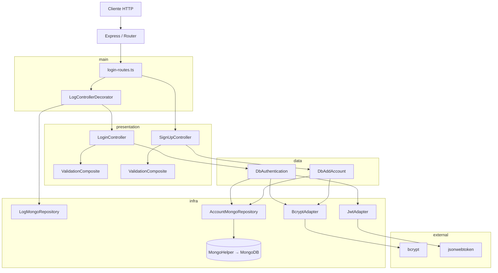

# Arquitetura — clean-node-api

> **Estilo arquitetural:** Clean Architecture (Robert C. Martin)

> **Stack:** Node.js · TypeScript · Express · MongoDB · JWT

> **Gerado em:** 2026-03-20

---

## Sumário

- [Visão Geral](#visão-geral)
- [Camadas da Arquitetura](#camadas-da-arquitetura)
  - [1. `domain/` — Núcleo de Negócio](#1-domain--núcleo-de-negócio)
  - [2. `data/` — Casos de Uso (Application Layer)](#2-data--casos-de-uso-application-layer)
  - [3. `infra/` — Infraestrutura](#3-infra--infraestrutura)
  - [4. `presentation/` — Camada de Apresentação HTTP](#4-presentation--camada-de-apresentação-http)
  - [5. `main/` — Composição e Bootstrap](#5-main--composição-e-bootstrap)
- [Fluxo de uma Requisição](#fluxo-de-uma-requisição)
- [Diagrama de Componentes](#diagrama-de-componentes)
- [Módulos e Responsabilidades](#módulos-e-responsabilidades)
  - [Factory: `makeSignUpController()`](#factory-makesignupcontroller)
  - [Factory: `makeLoginController()`](#factory-makelogincontroller)
  - [Decorator: `LogControllerDecorator`](#decorator-logcontrollerdecorator)
  - [Sistema de Validação](#sistema-de-validação)
  - [Carregamento de Rotas](#carregamento-de-rotas)
- [Protocolos e Abstrações](#protocolos-e-abstrações)
- [Padrões Adotados](#padrões-adotados)
- [Dependências](#dependências)
  - [Produção](#produção)
  - [Desenvolvimento / Tooling](#desenvolvimento--tooling)
- [Configuração e Ambiente](#configuração-e-ambiente)
- [Scripts e Automações](#scripts-e-automações)
  - [Git Hooks (Husky)](#git-hooks-husky)
- [Testes](#testes)
  - [Unitários (`*.spec.ts`)](#unitários-spects)
  - [Integração (`*.test.ts`)](#integração-testts)
- [Rotas da API](#rotas-da-api)
  - [`POST /api/signup`](#post-apisignup)
  - [`POST /api/login`](#post-apilogin)

---

## Visão Geral

O **clean-node-api** é uma API RESTful construída como estudo aplicado de **Clean Architecture**, onde cada decisão arquitetural prioriza separação de responsabilidades, testabilidade e independência de frameworks ou infraestrutura.

A arquitetura impõe que nenhuma camada interna dependa de camadas externas. O fluxo de dependências é sempre **de fora para dentro** — a infraestrutura depende do domínio, nunca o contrário.

```
┌─────────────────────────────────────────────────┐
│  main (Factories, Decorators, Routes, Config)   │ ← Composição
├─────────────────────────────────────────────────┤
│  presentation (Controllers, Validators, Errors) │ ← HTTP
├─────────────────────────────────────────────────┤
│  data (Use Cases, Protocols de dados)           │ ← Regras de aplicação
├─────────────────────────────────────────────────┤
│  domain (Models, Interfaces de Use Cases)       │ ← Regras de negócio puras
├─────────────────────────────────────────────────┤
│  infra (MongoDB, Bcrypt, JWT, Adapters)         │ ← Implementações externas
└─────────────────────────────────────────────────┘
```

---

## Camadas da Arquitetura

### 1. `domain/` — Núcleo de Negócio

Camada mais interna. Não importa nenhuma lib externa nem outra camada do projeto. Define contratos puros.

| Artefato | Tipo | Responsabilidade |
|---|---|---|
| `models/account.ts` | Interface | Modelo de domínio da Conta (`id`, `name`, `email`, `password`) |
| `useCases/add-account.ts` | Interface | Contrato `AddAccount` — entrada `AddAccountModel`, saída `AccountModel` |
| `useCases/authentication.ts` | Interface | Contrato `Authentication` — entrada `AuthenticationModel`, saída `string \| null` (accessToken) |

### 2. `data/` — Casos de Uso (Application Layer)

Implementa a lógica de aplicação usando apenas os contratos do `domain` e seus próprios protocolos. Nunca depende de frameworks ou infraestrutura diretamente.

| Artefato | Tipo | Responsabilidade |
|---|---|---|
| `useCases/add-account/db-add-account.ts` | Classe | Implementa `AddAccount`: hash de senha via `Hasher` e persiste via `AddAccountRepository` |
| `useCases/authentication/db-authentication.ts` | Classe | Implementa `Authentication`: carrega conta, compara hash, gera e persiste accessToken JWT |
| `protocols/criptography/encrypter.ts` | Interface | Contrato para geração de token (JWT) |
| `protocols/criptography/hasher.ts` | Interface | Contrato para hash de senhas |
| `protocols/criptography/hash-comparer.ts` | Interface | Contrato para comparação de hash de senha |
| `protocols/db/account/add-account-repository.ts` | Interface | Contrato para persistência de conta |
| `protocols/db/account/load-account-by-email-repository.ts` | Interface | Contrato para busca de conta por e-mail |
| `protocols/db/account/update-access-token-repository.ts` | Interface | Contrato para atualização do accessToken no banco |
| `protocols/db/log/log-error-repository.ts` | Interface | Contrato para persistência de erros de servidor |

### 3. `infra/` — Infraestrutura

Implementações concretas dos protocolos definidos pelas camadas internas. Aqui vivem os adaptadores de banco de dados e bibliotecas externas.

| Artefato | Tipo | Responsabilidade |
|---|---|---|
| `criptography/bcrypt-adapter/bcrypt-adapter.ts` | Classe | Implementa `Hasher` e `HashComparer` usando `bcrypt` (salt: 12) |
| `criptography/jwt-adapter/jwt-adapter.ts` | Classe | Implementa `Encrypter` usando `jsonwebtoken` — gera JWT assinado com `JWT_SECRET` |
| `db/mongodb/account/account-mongo-repository.ts` | Classe | Implementa `AddAccountRepository`, `LoadAccountByEmailRepository` e `UpdateAccessTokenRepository` |
| `db/mongodb/log/log-repository.ts` | Classe | Implementa `LogErrorRepository` — persiste stack traces de erros 500 no MongoDB |
| `db/mongodb/helpers/mongo-helper.ts` | Objeto | Gerencia conexão com o MongoDB (`connect`, `disconnect`, `getCollection`, `map`) |

### 4. `presentation/` — Camada de Apresentação HTTP

Responsável por adaptar o protocolo HTTP para as interfaces da camada de domínio/aplicação. Trata erros e formata respostas.

| Artefato | Tipo | Responsabilidade |
|---|---|---|
| `controllers/signup/signup-controller.ts` | Classe | Valida campos via `Validation`, confirma senha e chama `AddAccount` |
| `controllers/login/login-controller.ts` | Classe | Valida campos via `Validation` e chama `Authentication`; retorna `accessToken` |
| `helpers/http/http-helper.ts` | Funções | `badRequest` (400), `ok` (200), `serverError` (500), `unauthorized` (401) |
| `helpers/validators/validation-composite.ts` | Classe | Compõe múltiplos `Validation` em cadeia — retorna o primeiro erro encontrado |
| `helpers/validators/required-field-validation.ts` | Classe | Valida presença de campo obrigatório |
| `helpers/validators/compare-fields-validation.ts` | Classe | Valida se dois campos têm o mesmo valor (ex.: senha e confirmação) |
| `helpers/validators/email-validation.ts` | Classe | Valida formato de e-mail usando `EmailValidator` |
| `errors/missing-param-error.ts` | Classe | Erro: campo obrigatório ausente |
| `errors/invalid-param-error.ts` | Classe | Erro: campo com valor inválido |
| `errors/server-error.ts` | Classe | Erro: falha interna do servidor |
| `errors/unathorized-error.ts` | Classe | Erro: credenciais inválidas (401) |
| `protocols/controller.ts` | Interface | Contrato `Controller` com método `handle(req): Promise<HttpResponse>` |
| `protocols/email-validator.ts` | Interface | Contrato `EmailValidator` com método `isValid(email): boolean` |
| `protocols/validation.ts` | Interface | Contrato `Validation` com método `validate(input): Error \| null` |
| `protocols/http.ts` | Interfaces | `HttpRequest { body? }` e `HttpResponse { statusCode, body }` |

### 5. `main/` — Composição e Bootstrap

Ponto de entrada da aplicação. Reúne todas as camadas via **factories**, **decorators** e configura o servidor Express.

| Artefato | Responsabilidade |
|---|---|
| `server.ts` | Conecta ao MongoDB e sobe o servidor Express |
| `config/app.ts` | Cria instância Express, registra middlewares e rotas |
| `config/env.ts` | Centraliza variáveis de ambiente (`MONGO_URL`, `PORT`, `JWT_SECRET`) |
| `config/middlewares.ts` | Registra `cors`, `bodyParser`, `contentType` globalmente |
| `config/routes.ts` | Carrega automaticamente arquivos `*routes.ts` via `fast-glob` |
| `adapters/express/express-routes-adapter.ts` | Adapta route handler Express para o protocolo `Controller` |
| `adapters/validators/email-validator/email-validator-adapter.ts` | Implementa `EmailValidator` usando a lib `validator` |
| `factories/signup/signup-factory.ts` | `makeSignUpController()` — monta o grafo de dependências do signup com log decorator |
| `factories/signup/signup-validation-factory.ts` | `makeSignUpValidation()` — compõe as validações do signup |
| `factories/login/login-factory.ts` | `makeLoginController()` — monta o grafo de dependências do login com log decorator |
| `factories/login/login-validation-factory.ts` | `makeLoginValidation()` — compõe as validações do login |
| `decorators/log/log-controller-decorator.ts` | Decora qualquer `Controller`: loga no MongoDB erros com status 500 |
| `middlewares/` | Implementações dos middlewares globais (body-parser, cors, content-type) |
| `routes/login/login-routes.ts` | Define as rotas `POST /api/signup` e `POST /api/login` |

---

## Fluxo de uma Requisição

### `POST /api/login` (exemplo)

```
Cliente HTTP
    │
    ▼
Express Router  (/api/login)
    │
    ▼
login-routes.ts   (rota)
    │
    ▼
LogControllerDecorator.handle(httpRequest)   [main/decorators]
    │  (se statusCode 500 → logError no MongoDB)
    ▼
LoginController.handle(httpRequest)   [presentation]
    │  valida campos via ValidationComposite
    ▼
DbAuthentication.auth({ email, password })   [data]
    │
    ├──▶ AccountMongoRepository.loadByEmail(email)   [infra/db]
    │         └── MongoHelper.getCollection('accounts').findOne(...)
    │
    ├──▶ BcryptAdapter.compare(password, hash)   [infra/criptography]
    │         └── bcrypt.compare(...)
    │
    └──▶ JwtAdapter.encrypt(accountId)   [infra/criptography]
              └── jwt.sign({ id }, JWT_SECRET)
    │
    ├──▶ AccountMongoRepository.updateAccessToken(id, token)   [infra/db]
    │
    ▼
HttpResponse { statusCode: 200, body: { accessToken } }
    │
    ▼
Cliente HTTP
```

---

## Diagrama de Componentes



---

## Módulos e Responsabilidades

### Factory: `makeSignUpController()`

```
makeSignUpController()
  ├── new BcryptAdapter(salt: 12)
  ├── new AccountMongoRepository()
  ├── new DbAddAccount(bcryptAdapter, accountMongoRepository)
  ├── makeSignUpValidation()
  │     ├── RequiredFieldValidation('name')
  │     ├── RequiredFieldValidation('email')
  │     ├── RequiredFieldValidation('password')
  │     ├── RequiredFieldValidation('passwordConfirmation')
  │     ├── CompareFieldsValidation('password', 'passwordConfirmation')
  │     └── EmailValidation('email', emailValidatorAdapter)
  ├── new SignUpController(dbAddAccount, validation)
  ├── new LogMongoRepository()
  └── new LogControllerDecorator(signUpController, logMongoRepository)
```

### Factory: `makeLoginController()`

```
makeLoginController()
  ├── new BcryptAdapter(salt: 12)
  ├── new AccountMongoRepository()
  ├── new JwtAdapter(env.jwtSecret)
  ├── new DbAuthentication(accountMongoRepository, bcryptAdapter, jwtAdapter, accountMongoRepository)
  ├── makeLoginValidation()
  │     ├── RequiredFieldValidation('email')
  │     ├── RequiredFieldValidation('password')
  │     └── EmailValidation('email', emailValidatorAdapter)
  ├── new LoginController(authentication, validation)
  ├── new LogMongoRepository()
  └── new LogControllerDecorator(loginController, logMongoRepository)
```

### Decorator: `LogControllerDecorator`

O `LogControllerDecorator` envolve qualquer `Controller` e intercepta erros de servidor (status 500). Quando detectado, persiste o stack trace no MongoDB via `LogErrorRepository`, sem impactar o fluxo normal da resposta.

```
LogControllerDecorator
  ├── delega para o Controller decorado
  └── se statusCode === 500
        └── LogMongoRepository.logError(stack)
```

### Sistema de Validação

O projeto utiliza o padrão **Composite** para composição de validações. Cada validação é uma classe independente que implementa o protocolo `Validation`:

| Classe | Responsabilidade |
|---|---|
| `ValidationComposite` | Executa todas as validações em sequência; retorna o primeiro erro |
| `RequiredFieldValidation` | Garante que o campo existe e não está vazio |
| `CompareFieldsValidation` | Garante que dois campos possuem o mesmo valor |
| `EmailValidation` | Garante que o campo é um e-mail válido |

### Carregamento de Rotas

As rotas são carregadas **automaticamente** via `fast-glob`:

```ts
fg.sync("src/main/routes/**/**routes.ts").map((file) => {
  const route = require(path.resolve(file));
  route.default(router);
});
```

Qualquer arquivo com sufixo `routes.ts` dentro de `src/main/routes/` é automaticamente registrado no router `/api`.

---

## Protocolos e Abstrações

O projeto usa o padrão **Port & Adapter (Hexagonal)**: as camadas internas definem interfaces (ports) e as externas proveem implementações (adapters).

| Protocol (Port) | Definido em | Implementado por |
|---|---|---|
| `AddAccount` | `domain/useCases` | `data/useCases/db-add-account.ts` |
| `Authentication` | `domain/useCases` | `data/useCases/db-authentication.ts` |
| `AddAccountRepository` | `data/protocols/db/account` | `infra/db/mongodb/account/account-mongo-repository.ts` |
| `LoadAccountByEmailRepository` | `data/protocols/db/account` | `infra/db/mongodb/account/account-mongo-repository.ts` |
| `UpdateAccessTokenRepository` | `data/protocols/db/account` | `infra/db/mongodb/account/account-mongo-repository.ts` |
| `LogErrorRepository` | `data/protocols/db/log` | `infra/db/mongodb/log/log-repository.ts` |
| `Hasher` | `data/protocols/criptography` | `infra/criptography/bcrypt-adapter/bcrypt-adapter.ts` |
| `HashComparer` | `data/protocols/criptography` | `infra/criptography/bcrypt-adapter/bcrypt-adapter.ts` |
| `Encrypter` | `data/protocols/criptography` | `infra/criptography/jwt-adapter/jwt-adapter.ts` |
| `EmailValidator` | `presentation/protocols` | `main/adapters/validators/email-validator/email-validator-adapter.ts` |
| `Validation` | `presentation/protocols` | `presentation/helpers/validators/*.ts` |
| `Controller` | `presentation/protocols` | `presentation/controllers/**/*.ts` |

---

## Padrões Adotados

| Padrão | Onde é aplicado |
|---|---|
| **Clean Architecture** | Organização em camadas com dependência unidirecional |
| **Dependency Injection** | Construtores recebem toda dependência como argumento |
| **Adapter** | `BcryptAdapter`, `JwtAdapter`, `EmailValidatorAdapter`, `AccountMongoRepository` |
| **Factory** | `makeSignUpController()` e `makeLoginController()` em `main/factories/` |
| **Decorator** | `LogControllerDecorator` em `main/decorators/log/` |
| **Composite** | `ValidationComposite` em `presentation/helpers/validators/` |
| **Repository** | `AccountMongoRepository`, `LogMongoRepository` — abstraem acesso ao banco |
| **Port & Adapter** | Protocolos em `data/protocols` e `presentation/protocols` |
| **Barrel exports** | `presentation/errors/index.ts`, `presentation/protocols/index.ts`, `presentation/helpers/validators/index.ts` |

---

## Dependências

### Produção

| Dependência | Versão | Finalidade |
|---|---|---|
| `express` | ^5.2.1 | Framework HTTP |
| `mongodb` | ^7.1.0 | Driver oficial MongoDB |
| `bcrypt` | ^6.0.0 | Hash e comparação de senhas |
| `jsonwebtoken` | ^9.0.3 | Geração e assinatura de JWT |
| `validator` | ^13.15.26 | Validação de e-mail (e outros formatos) |
| `fast-glob` | ^3.3.3 | Carregamento automático de arquivos de rota |
| `dotenv` | ^17.3.1 | Leitura de variáveis de ambiente |

### Desenvolvimento / Tooling

| Dependência | Finalidade |
|---|---|
| `typescript` ^5.9.3 | Linguagem tipada |
| `sucrase` ^3.35.1 | Transpiler rápido para execução em dev |
| `ts-jest` ^29.4.6 | Execução de testes TypeScript com Jest |
| `jest` ^30.3.0 | Framework de testes |
| `supertest` ^7.2.2 | Testes de integração HTTP |
| `@shelf/jest-mongodb` ^6.0.2 | Ambiente MongoDB in-memory para testes |
| `eslint` ^9.39.4 + plugins | Linting estático do código |
| `husky` ^9.1.7 | Git hooks (pre-commit, commit-msg) |
| `lint-staged` ^16.3.3 | Lint apenas nos arquivos staged |
| `git-commit-msg-linter` ^5.0.8 | Validação do padrão de mensagem de commit |

---

## Configuração e Ambiente

O arquivo `src/main/config/env.ts` centraliza todas as variáveis:

| Variável | Padrão | Descrição |
|---|---|---|
| `MONGO_URL` | `mongodb://localhost:27017/clean-node-api` | URI de conexão com o MongoDB |
| `PORT` | `5050` | Porta em que o servidor HTTP escuta |
| `JWT_SECRET` | _(valor padrão interno)_ | Segredo para assinatura dos tokens JWT |

Configure via arquivo `.env` na raiz do projeto:

```env
MONGO_URL=mongodb://localhost:27017/clean-node-api
PORT=5050
JWT_SECRET=seu_segredo_aqui
```

---

## Scripts e Automações

| Script | Comando | Descrição |
|---|---|---|
| `start` | `sucrase-node src/main/server.ts` | Sobe o servidor em desenvolvimento |
| `test` | `jest --passWithNoTests --silent --noStackTrace --runInBand` | Roda todos os testes |
| `test:verbose` | `jest --passWithNoTests --runInBand` | Testes com saída completa |
| `test:unit` | `npm test -- --watch -c jest-unit-config.js` | Testes unitários em modo watch |
| `test:integration` | `npm test -- --watch -c jest-integration-config.js` | Testes de integração em modo watch |
| `test:ci` | `npm test -- --coverage` | Testes com relatório de cobertura |
| `test:staged` | `npm test -- --findRelatedTests` | Testes relacionados aos arquivos staged (usado pelo husky) |

### Git Hooks (Husky)

| Hook | Ação |
|---|---|
| `pre-commit` | Roda `lint-staged` → executa ESLint + `test:staged` nos arquivos modificados |
| `commit-msg` | Valida o padrão da mensagem de commit via `git-commit-msg-linter` |

---

## Testes

O projeto adota **TDD** com separação clara entre testes unitários e de integração.

### Unitários (`*.spec.ts`)

Usam **mocks manuais** — nenhuma dependência externa real é utilizada.

| Arquivo de Teste | O que testa |
|---|---|
| `data/useCases/add-account/db-add-account.spec.ts` | `DbAddAccount`: hash de senha + persistência via mocks |
| `data/useCases/authentication/db-authentication.spec.ts` | `DbAuthentication`: fluxo completo de autenticação com mocks |
| `infra/criptography/bcrypt-adapter/bcrypt-adapter.spec.ts` | `BcryptAdapter`: integração com `bcrypt` (hash e compare) |
| `infra/criptography/jwt-adapter/jwt-adapter.spec.ts` | `JwtAdapter`: geração de token JWT |
| `infra/db/mongodb/log/log-mongo-repository.spec.ts` | `LogMongoRepository`: persistência de erros no MongoDB |
| `presentation/controllers/signup/signup-controller.spec.ts` | `SignUpController`: validações HTTP + retornos corretos |
| `presentation/controllers/login/login-controller.spec.ts` | `LoginController`: validações + autenticação + retornos |
| `presentation/helpers/validators/validation-composite.spec.ts` | `ValidationComposite`: composição de validações |
| `presentation/helpers/validators/required-field-validation.spec.ts` | `RequiredFieldValidation`: validação de campo obrigatório |
| `presentation/helpers/validators/compare-fields-validation.spec.ts` | `CompareFieldsValidation`: comparação de campos |
| `presentation/helpers/validators/email-validation.spec.ts` | `EmailValidation`: validação de e-mail |
| `main/adapters/validators/email-validator/email-validator-adapter.spec.ts` | `EmailValidatorAdapter`: integração com `validator` |
| `main/decorators/log/log-controller-decorator.spec.ts` | `LogControllerDecorator`: log de erros 500 via repositório |
| `main/factories/signup/signup-validation-factory.spec.ts` | `makeSignUpValidation()`: composição correta das validações |
| `main/factories/login/login-validation-factory.spec.ts` | `makeLoginValidation()`: composição correta das validações |

### Integração (`*.test.ts`)

Usam o banco MongoDB real em memória (`@shelf/jest-mongodb`) e `supertest` para chamadas HTTP reais.

| Arquivo de Teste | O que testa |
|---|---|
| `infra/db/mongodb/account/account-mongo-repository.spec.ts` | `AccountMongoRepository` contra MongoDB real |
| `infra/db/mongodb/helpers/mongo-helper.spec.ts` | `MongoHelper`: conexão, desconexão e reconexão automática |
| `main/middlewares/body-parser/body-parser-middleware.test.ts` | Middleware de parse do body |
| `main/middlewares/content-type/content-type-middleware.test.ts` | Middleware de content-type |
| `main/middlewares/cors/cors-middleware.test.ts` | Middleware de CORS |
| `main/routes/login/login-routes.test.ts` | Rotas `POST /api/signup` e `POST /api/login` via supertest |

---

## Rotas da API

Base URL: `http://localhost:5050/api`

| Método | Rota | Descrição |
|---|---|---|
| `POST` | `/api/signup` | Cadastro de novo usuário |
| `POST` | `/api/login` | Autenticação de usuário existente |

### `POST /api/signup`

**Request Body:**
```json
{
  "name": "John Doe",
  "email": "john@example.com",
  "password": "secret123",
  "passwordConfirmation": "secret123"
}
```

**Respostas:**

| Status | Condição | Body |
|---|---|---|
| `200 OK` | Conta criada com sucesso | `AccountModel { id, name, email, password }` |
| `400 Bad Request` | Campo obrigatório ausente | `{ error: "Missing param: <campo>" }` |
| `400 Bad Request` | Senha e confirmação diferentes | `{ error: "Invalid param: passwordConfirmation" }` |
| `400 Bad Request` | E-mail inválido | `{ error: "Invalid param: email" }` |
| `500 Internal Server Error` | Falha interna inesperada | `{ error: "Internal server error" }` |

---

### `POST /api/login`

**Request Body:**
```json
{
  "email": "john@example.com",
  "password": "secret123"
}
```

**Respostas:**

| Status | Condição | Body |
|---|---|---|
| `200 OK` | Autenticado com sucesso | `{ accessToken: "<JWT>" }` |
| `400 Bad Request` | Campo obrigatório ausente | `{ error: "Missing param: <campo>" }` |
| `400 Bad Request` | E-mail inválido | `{ error: "Invalid param: email" }` |
| `401 Unauthorized` | Credenciais inválidas | `{ error: "Unauthorized" }` |
| `500 Internal Server Error` | Falha interna inesperada | `{ error: "Internal server error" }` |
